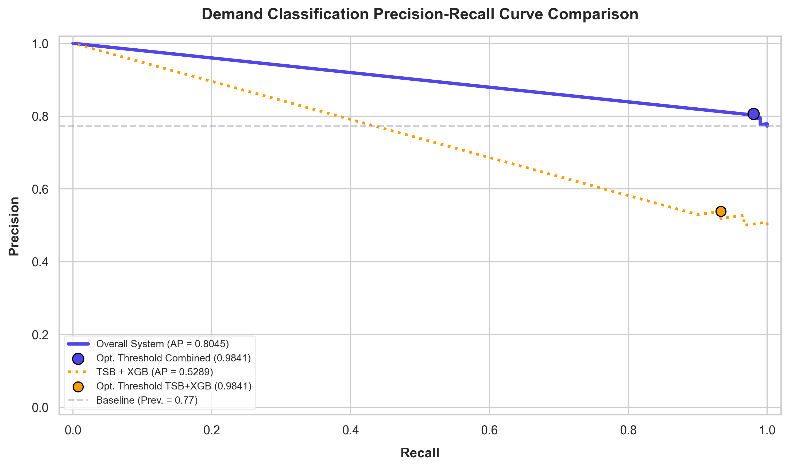

# Demand Classification Performance Report

This report evaluates the performance of the **Demand Classifier** across the walk-forward validation phase. We evaluate metrics for the **Overall System**, and break down the performance between **ARIMA+XGB** (routed for smooth/erratic demand) and **TSB+XGB** (routed for sparse, intermittent/lumpy demand).

---

## Executive Summary

| Model Subset | Total Support | Average Precision (AP) | Optimal Threshold | Optimal F1-Score | Precision (Opt) | Recall (Opt) |
| :--- | :---: | :---: | :---: | :---: | :---: | :---: |
| **Overall System** | `132` | `0.8045` | `0.9841` | `0.8850` | `0.8065` | `0.9804` |
| **ARIMA + XGB** | `N/A` | `N/A` | `N/A` | `N/A` | `N/A` | `N/A` |
| **TSB + XGB** | `60` | `0.5289` | `0.9841` | `0.6829` | `0.5385` | `0.9333` |

*Note: If a subset displays **N/A**, it indicates that the subset did not contain a mixture of both 'Demand' and 'No Demand' periods during the 12 validation epochs, making a binary PR curve calculation mathematically undefined for that subset.*

---

## Precision-Recall Visualization

The multi-curve plot below highlights the different behavior of the two hybrid model variations. ARIMA+XGB operates on high-density active series, while TSB+XGB addresses highly sparse, zero-prone series.

---

## Classification Matrices (Optimal Thresholds)

### 1. Overall System (Threshold: 0.9841)
- **Support**: 132 validation epochs (102 Demand, 30 No Demand)

| Actual / Predicted | Predicted No Demand | Predicted Demand | Recall |
| :--- | :---: | :---: | :---: |
| **Actual No Demand** | `6` | `24` | `20.00%` |
| **Actual Demand** | `2` | `100` | `98.04%` |
| **Precision** | `75.00%` | `80.65%` | |

### 2. ARIMA + XGB Subset (Threshold: N/A)
- **Support**: N/A validation epochs (0 Demand, 0 No Demand)

| Actual / Predicted | Predicted No Demand | Predicted Demand | Recall |
| :--- | :---: | :---: | :---: |
| **Actual No Demand** | `0` | `0` | `N/A` |
| **Actual Demand** | `0` | `0` | `N/A` |
| **Precision** | `N/A` | `N/A` | |

### 3. TSB + XGB Subset (Threshold: 0.9841)
- **Support**: 60 validation epochs (30 Demand, 30 No Demand)

| Actual / Predicted | Predicted No Demand | Predicted Demand | Recall |
| :--- | :---: | :---: | :---: |
| **Actual No Demand** | `6` | `24` | `20.00%` |
| **Actual Demand** | `2` | `28` | `93.33%` |
| **Precision** | `75.00%` | `53.85%` | |

---

## Series Classification Breakdown

The table below lists each of the 11 time-series in the system, their computed ADI/CV² values, and their assigned model algorithm:

| Series Name | Series Kind | ADI | CV² | Demand Type | Selected Algorithm |
| :--- | :--- | :---: | :---: | :--- | :--- |
| Air Filter | product | 1.00 | 0.02 | SMOOTH | ARIMA_XGB |
| Alternator | product | 1.62 | 0.02 | INTERMITTENT | TSB_XGB |
| Battery | product | 2.31 | 0.01 | INTERMITTENT | TSB_XGB |
| Brake Pads | product | 1.00 | 0.01 | SMOOTH | ARIMA_XGB |
| Catalytic Converter | product | 2.40 | 0.80 | LUMPY | TSB_XGB |
| ECU Module | product | 3.16 | 0.70 | LUMPY | TSB_XGB |
| Oil Filter | product | 1.00 | 0.02 | SMOOTH | ARIMA_XGB |
| Shock Absorber | product | 1.00 | 0.60 | ERRATIC | ARIMA_XGB |
| Starter Motor | product | 1.58 | 0.01 | INTERMITTENT | TSB_XGB |
| Wheel Bearing | product | 1.00 | 0.70 | ERRATIC | ARIMA_XGB |
| Business Total Revenue | business_revenue | 1.00 | 0.99 | ERRATIC | ARIMA_XGB |

---

## Walk-Forward Regression Metrics

| Series | Algorithm | R² | MASE | RMSE | MAE | MAPE | sMAPE | WAPE |
| :--- | :--- | :---: | :---: | :---: | :---: | :---: | :---: | :---: |
| Air Filter | ARIMA_XGB | `-0.1118` | `0.6695` | `13.44` | `9.89` | `10.65` | `10.08` | `10.02` |
| Alternator | TSB_XGB | `-0.4263` | `0.9429` | `41.33` | `38.46` | `46.87` | `121.32` | `99.89` |
| Battery | TSB_XGB | `0.1600` | `0.6077` | `28.15` | `21.98` | `45.20` | `139.64` | `84.81` |
| Brake Pads | ARIMA_XGB | `-0.4183` | `0.6173` | `14.01` | `11.64` | `8.18` | `8.38` | `8.33` |
| Catalytic Converter | TSB_XGB | `-0.2218` | `0.9705` | `93.06` | `72.83` | `88.50` | `161.22` | `115.91` |
| ECU Module | TSB_XGB | `-0.1703` | `0.7293` | `172.40` | `93.54` | `543.06` | `185.24` | `135.89` |
| Oil Filter | ARIMA_XGB | `-0.4689` | `0.6674` | `18.35` | `15.59` | `11.78` | `11.68` | `11.48` |
| Shock Absorber | ARIMA_XGB | `-0.2583` | `0.7046` | `73.58` | `66.98` | `416.78` | `94.48` | `85.60` |
| Starter Motor | TSB_XGB | `-0.5139` | `0.8206` | `26.95` | `22.70` | `35.59` | `88.28` | `62.47` |
| Wheel Bearing | ARIMA_XGB | `0.0078` | `0.6694` | `55.77` | `42.65` | `152.73` | `53.02` | `48.70` |
| Business Total Revenue | ARIMA_XGB | `-0.3239` | `0.7434` | `4533540.80` | `2883543.89` | `83.72` | `67.82` | `69.73` |

*R² > 0 indicates the model explains variance better than the mean. MASE < 1 indicates the model outperforms the in-sample naïve forecast (Hyndman & Koehler, 2006).*

---

## Diebold-Mariano Statistical Significance Tests

### Hybrid vs. Standalone (Base Model Only)

*Tests whether the XGBoost residual correction significantly improves forecast accuracy over the base statistical model alone.*

| Series | Algorithm | DM Statistic | p-value | Significant (p<0.05) | Better Model |
| :--- | :--- | :---: | :---: | :---: | :--- |
| Air Filter | ARIMA_XGB | `0.3528` | `0.7309` | ❌ No | Standalone (ARIMA) |
| Alternator | TSB_XGB | `-1.2094` | `0.2519` | ❌ No | Hybrid (TSB_XGB) |
| Battery | TSB_XGB | `-2.2656` | `0.0446` | ✅ Yes | Hybrid (TSB_XGB) |
| Brake Pads | ARIMA_XGB | `0.7206` | `0.4862` | ❌ No | Standalone (ARIMA) |
| Catalytic Converter | TSB_XGB | `0.4708` | `0.6470` | ❌ No | Standalone (TSB) |
| ECU Module | TSB_XGB | `-1.1587` | `0.2711` | ❌ No | Hybrid (TSB_XGB) |
| Oil Filter | ARIMA_XGB | `0.9475` | `0.3637` | ❌ No | Standalone (ARIMA) |
| Shock Absorber | ARIMA_XGB | `0.1640` | `0.8727` | ❌ No | Standalone (ARIMA) |
| Starter Motor | TSB_XGB | `0.2715` | `0.7910` | ❌ No | Standalone (TSB) |
| Wheel Bearing | ARIMA_XGB | `-0.2161` | `0.8329` | ❌ No | Hybrid (ARIMA_XGB) |
| Business Total Revenue | ARIMA_XGB | `0.9874` | `0.3447` | ❌ No | Standalone (ARIMA) |

### Hybrid vs. Naïve Forecast (Last Observed Value)

*Tests whether the hybrid model significantly outperforms a simple naïve baseline that predicts the last observed value.*

| Series | Algorithm | DM Statistic | p-value | Significant (p<0.05) | Better Model |
| :--- | :--- | :---: | :---: | :---: | :--- |
| Air Filter | ARIMA_XGB | `-1.4507` | `0.1748` | ❌ No | Hybrid (ARIMA_XGB) |
| Alternator | TSB_XGB | `-3.0799` | `0.0105` | ✅ Yes | Hybrid (TSB_XGB) |
| Battery | TSB_XGB | `-1.9861` | `0.0725` | ❌ No | Hybrid (TSB_XGB) |
| Brake Pads | ARIMA_XGB | `0.5227` | `0.6115` | ❌ No | Naïve |
| Catalytic Converter | TSB_XGB | `-0.2607` | `0.7991` | ❌ No | Hybrid (TSB_XGB) |
| ECU Module | TSB_XGB | `-1.0055` | `0.3362` | ❌ No | Hybrid (TSB_XGB) |
| Oil Filter | ARIMA_XGB | `-0.3908` | `0.7034` | ❌ No | Hybrid (ARIMA_XGB) |
| Shock Absorber | ARIMA_XGB | `-1.4718` | `0.1691` | ❌ No | Hybrid (ARIMA_XGB) |
| Starter Motor | TSB_XGB | `-1.8890` | `0.0855` | ❌ No | Hybrid (TSB_XGB) |
| Wheel Bearing | ARIMA_XGB | `-1.6179` | `0.1340` | ❌ No | Hybrid (ARIMA_XGB) |
| Business Total Revenue | ARIMA_XGB | `-1.2551` | `0.2355` | ❌ No | Hybrid (ARIMA_XGB) |

---

## Hybrid Component Contribution Analysis

*Measures how much the XGBoost residual correction component improves the base statistical model (ARIMA or TSB).*

| Series | Algorithm | Standalone MAE | Hybrid MAE | MAE Improvement % | Standalone RMSE | Hybrid RMSE | RMSE Improvement % | Residual Var. Reduction % |
| :--- | :--- | :---: | :---: | :---: | :---: | :---: | :---: | :---: |
| Air Filter | ARIMA_XGB | `9.81` | `9.89` | `-0.8%` | `12.86` | `13.44` | `-4.5%` | `-7.7%` |
| Alternator | TSB_XGB | `41.27` | `38.46` | `6.8%` | `44.74` | `41.33` | `7.6%` | `11.8%` |
| Battery | TSB_XGB | `25.81` | `21.98` | `14.8%` | `32.73` | `28.15` | `14.0%` | `26.2%` |
| Brake Pads | ARIMA_XGB | `11.87` | `11.64` | `1.9%` | `13.01` | `14.01` | `-7.7%` | `-13.6%` |
| Catalytic Converter | TSB_XGB | `75.48` | `72.83` | `3.5%` | `91.44` | `93.06` | `-1.8%` | `-1.5%` |
| ECU Module | TSB_XGB | `93.54` | `93.54` | `0.0%` | `172.40` | `172.40` | `0.0%` | `0.0%` |
| Oil Filter | ARIMA_XGB | `12.65` | `15.59` | `-23.2%` | `16.13` | `18.35` | `-13.8%` | `-36.1%` |
| Shock Absorber | ARIMA_XGB | `62.92` | `66.98` | `-6.5%` | `72.60` | `73.58` | `-1.4%` | `1.3%` |
| Starter Motor | TSB_XGB | `23.46` | `22.70` | `3.2%` | `26.44` | `26.95` | `-1.9%` | `-5.7%` |
| Wheel Bearing | ARIMA_XGB | `47.27` | `42.65` | `9.8%` | `58.15` | `55.77` | `4.1%` | `19.4%` |
| Business Total Revenue | ARIMA_XGB | `2687167.50` | `2883543.88` | `-7.3%` | `4153030.88` | `4533540.80` | `-9.2%` | `-17.3%` |

*Positive improvement % indicates XGB correction reduces forecast error. Negative values indicate the base model alone was more accurate.*

---
*Report generated automatically by the `generate_pr_curve.py` script.*
